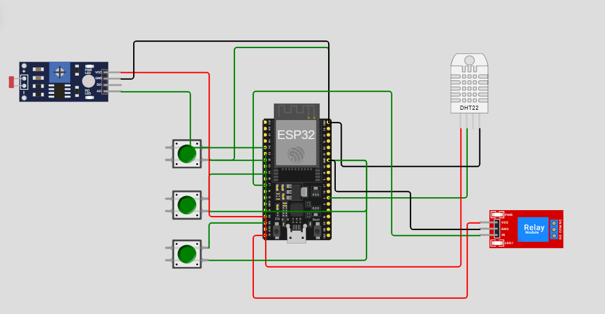

# FIAP - Faculdade de Informática e Administração Paulista

 

# Projeto PBL - Fase 2, Cap. 1: "Um Mapa do Tesouro"

### Contribuição
- **Autores:** Maria Luiza Oliveira Carvalho, Miriã Leal Mantovani, João Pedro Santos Azevedo e Rodrigo de Souza Freitas.
- **Tutora:** Sabrina Otoni

### Visão Geral do Projeto
Este projeto, desenvolvido como parte da Fase 2, Capítulo 1 do Programa PBL, demonstra a aplicação de Internet das Coisas (IoT) e Inteligência Artificial (IA) em um ambiente agrícola. O sistema de irrigação inteligente, simulado com um microcontrolador ESP32 na plataforma Wokwi.com, otimiza o uso de água e maximiza a produtividade, tomando decisões de irrigação com base em dados de sensores e informações externas.

O objetivo principal é simular uma fazenda inteligente, onde a irrigação não é apenas automatizada, mas também "consciente", evitando desperdícios e garantindo que a cultura receba água somente quando necessário e em condições ideais.

### Componentes de Hardware
O projeto utiliza os seguintes componentes, simulados no Wokwi:
- **ESP32 Dev Kit C V4:** O microcontrolador principal que processa a lógica de decisão.
- **Sensor DHT22:** Simula a umidade do solo.
- **Sensor LDR (Fotoresistor):** Simula o pH do solo, ajustando o valor analógico de 0 a 4095.
- **Botões (N, P, K):** Simulam a presença de Nitrogênio, Fósforo e Potássio no solo.
  - **Botão do Fósforo (P):** Conectado ao pino 32.
  - **Botão do Potássio (K):** Conectado ao pino 33.
  - **Botão do Nitrogênio (N):** Conectado ao pino 35.
- **Módulo Relé:** Simula a bomba d'água, que liga e desliga para controlar a irrigação.

### Lógica de Funcionamento
A lógica de decisão da irrigação é robusta e multifatorial, combinando a leitura de sensores locais com dados externos.

#### Lógica Básica de Irrigação
A bomba d'água é ativada apenas se **todas** as seguintes condições dos sensores forem atendidas:
- **Umidade do Solo:** A umidade do solo lida pelo DHT22 é **igual ou menor que 50%**.
- **pH do Solo:** O pH lido (simulado pelo LDR) está na **faixa ideal entre 5.5 e 7.5**.
- **Níveis de NPK:** Os botões de **Nitrogênio, Fósforo e Potássio estão todos pressionados**, indicando a presença desses nutrientes.

Se qualquer uma dessas condições não for atendida, o sistema considera que a irrigação não é necessária e a bomba permanece desligada.

### Opcional: Programa "Ir Além" - Integração com API Externa
Para aprimorar a inteligência do sistema, foi implementada a integração com a **API pública da OpenWeatherMap**. Esta funcionalidade permite que o sistema use a previsão do tempo para tomar decisões mais estratégicas, economizando água e energia.

- **Fluxo de Integração:**
  1. Um script em **Python** se conecta à API da OpenWeatherMap e verifica a previsão do tempo para uma cidade específica.
  2. O script analisa os dados e decide se a previsão é de chuva.
  3. Com base na análise, ele envia um comando para o Monitor Serial do ESP32:
     - Envia o caractere **'1'** se houver previsão de chuva.
     - Envia o caractere **'0'** se não houver previsão de chuva.
- **Lógica de "Override":**
  A decisão da API externa funciona como um comando de **"override"**. Se o comando '1' for recebido, a bomba de irrigação é **suspensa imediatamente**, independentemente das condições dos sensores locais. Isso evita o desperdício de água em caso de chuva iminente.

### Circuito do Projeto
A seguir, o diagrama do circuito desenvolvido na plataforma Wokwi.

### Estrutura de Pastas
O repositório está organizado da seguinte forma:
- `/codigo`: Contém o código-fonte principal (`sketch.ino`) e o código json do diagrama (diagra.json).
- `/documentacao`: Contém a documentação do projeto (`README.md`).
- `/imagens`: Contém o diagrama do circuito.
- `/opcionais`: Contém o script Python para a integração com a API (`api_weather.py`).

### Como Usar e Testar o Projeto

1.  **Acesse o Wokwi.com:** Abra o projeto com o link fornecido ou faça o upload do `sketch.ino` e `diagram.json`.
2.  **Inicie a Simulação:** Clique no botão de `Play` no Wokwi.
3.  **Monitore o Comportamento:** Acompanhe as leituras dos sensores e o status da bomba no Monitor Serial.
4.  **Teste a Lógica:**
    - Manipule o controle deslizante do sensor DHT22 e o sensor LDR.
    - Clique nos botões virtuais para simular os níveis de N, P e K.
5.  **Teste a Integração com a API:**
    - Execute o script `api_weather.py` no seu computador.
    - Digite o comando (1 ou 0) que o script exibe no Monitor Serial do Wokwi para controlar o sistema remotamente.

### Demonstração em Vídeo
- **Link do Vídeo:** https://youtu.be/VDh1yUNcvDM
